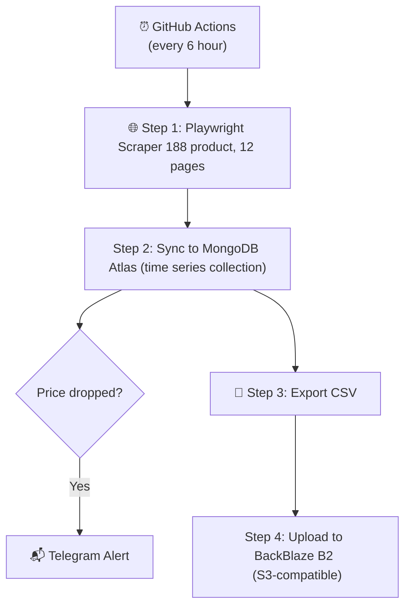
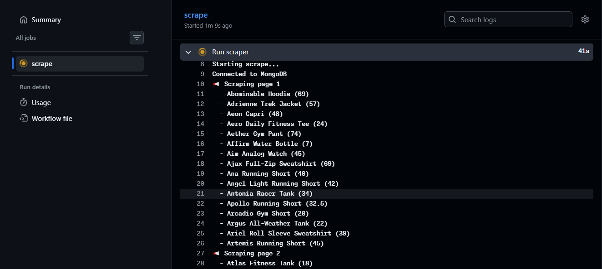
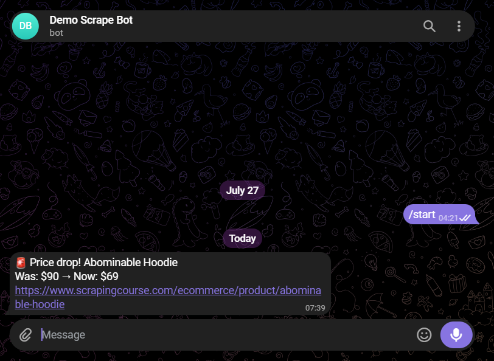

# Price Watch

E-commerce price tracker that monitors product prices and sends Telegram alerts when prices drop.

## How It Works



## Demo

### Scraper Running on GitHub Actions


### Telegram Price Drop Alert


## Features

- Scrapes 188 products across 12 pages
- Detects sale prices vs normal prices
- Identifies variant vs simple products
- Stores price history in MongoDB time series collection
- Sends Telegram alert when price drops
- Runs automatically every 6 hours via GitHub Actions

## Tech Stack

- Node.js 24 + TypeScript
- Playwright (browser automation)
- MongoDB Atlas (time series collection)
- Telegram Bot API
- GitHub Actions (scheduling)

## Local Setup

1. Clone the repo
2. Install dependencies
   ```bash
   npm install
   ```
3. Install Playwright browser
   ```bash
   npx playwright install chromium
   ```
4. Copy `.env.example` to `.env` and fill in your values
   ```bash
   cp .env.example .env
   ```
5. Run the scraper once
   ```bash
   node src/index.ts
   ```

## Deployment (GitHub Actions)

1. Push the repository to GitHub
2. Go to **Settings → Secrets and variables → Actions**
3. Add the following repository secrets:
   - `MONGODB_URI`
   - `TELEGRAM_BOT_TOKEN`
   - `TELEGRAM_CHAT_ID`
   - `B2_KEY_ID`
   - `B2_APP_KEY`
   - `B2_BUCKET_NAME`
   - `B2_REGION`
   - `B2_ENDPOINT`
   > **Note:** B2_* keys are used to upload csv file to BackBlaze B2 Cloud storage (here you can use any S3-compatible cloud storage)
   - `ATLAS_PUBLIC_KEY`
   - `ATLAS_PRIVATE_KEY`
   > **Note:** `ATLAS_PUBLIC_KEY` and `ATLAS_PRIVATE_KEY` are MongoDB Atlas Organization API key.\
   > Go to **Project → Project Identity & Access → Applications -> API Keys → Create API Key** with **Project Network Access Manager** role.
4. Add the following repository variable:
   - `ATLAS_GROUP_ID`
   > **Note:** `ATLAS_GROUP_ID` is your Project ID, found under MongoDB Atlas **Project Settings**.
5. Go to the **Actions** tab and trigger manually via **"Run workflow"**

The scraper will then run automatically every 6 hours.